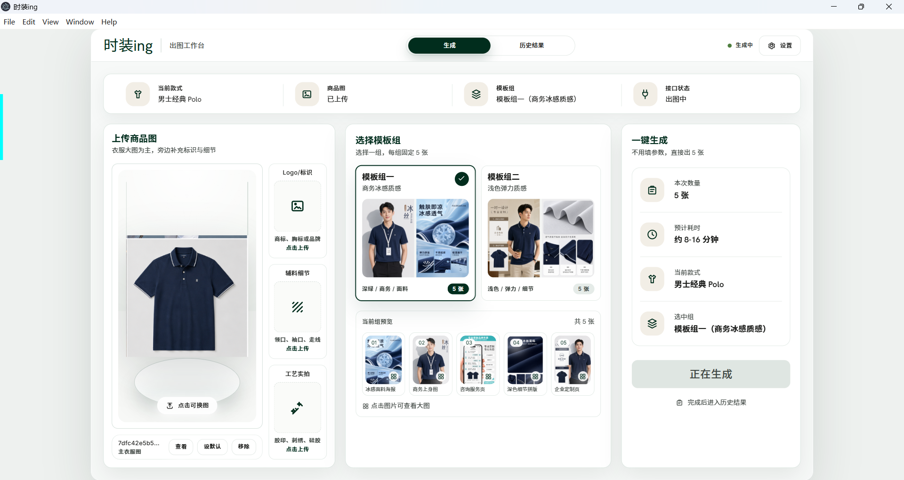

# Trying On｜试装（正在进行时）

Trying On 是一款 Windows 桌面版服装电商出图工具。它面向服装商家、电商运营、图片制作人员和需要快速做商品图的店铺，把服装出图流程压缩到一个清晰的工作台里：上传商品图、选择模板组、生成图片、查看历史结果。

## 最新更新 v0.1.1｜时装ing出图工作台优化

v0.1.1 重点优化了新版三栏出图工作台：

- 上传区改为“产品摄影台”风格，主商品图预览更清楚。
- 右侧新增补充素材卡，支持 `Logo/标识`、`辅料细节`、`工艺实拍` 上传、替换和移除。
- 顶部只保留 `生成` 和 `历史结果` 两个入口。
- 模板选择固定为两个模板组，每组展示 5 张参考预览。
- 点击模板预览可以打开大图画廊，方便查看模板细节。
- 历史结果页可以查看本机生成记录。
- 已用真实接口测试，一组 5 张可以按配置自动调用 API 生成。

## 下载

普通用户请下载 Release 发布包，不要下载右上角绿色 `Code -> Download ZIP`。绿色按钮下载的是源码包，不是可直接运行的软件。

**最新版下载：** <https://github.com/kira987654321/trying-on/releases/tag/v0.1.1>

下载后这样运行：

1. 下载 Release 里的 `trying-on-0.1.1-win-x64.zip`
2. 解压 zip
3. 进入 `时装ing-win-x64`
4. 双击 `时装ing.exe`
5. 打开软件右上角 `设置`
6. 填写 `Base URL`、`API Key` 和模型名
7. 回到 `生成` 页面上传商品图，选择模板组后开始生成

Release 包里包含 `时装ing.exe`、`resources/` 和 Electron 运行依赖。请不要只分发单独的 exe 文件。

## 真实生成样张

以下样张来自 v0.1.1 测试素材与实际生成结果，用于展示新版工作台的出图效果。

  
  
  
  
  

  
  
  
  
  

## 主要能力

- 服装商品图上传和素材复用
- 产品摄影台式主图预览
- Logo、辅料、工艺细节素材补充
- 两个模板组，每组 5 张模板参考图
- 批量生成一组 5 张结果
- 本地历史结果查看
- Windows 桌面端运行

## API 和 Base URL 配置

Trying On 使用 OpenAI-compatible image generation API。项目不会在 GitHub 上写死服务商地址，也不会保存或公开你的密钥。

首次使用时，在软件右上角打开 `设置`，填写三项配置：

- `Base URL`：你的图片生成接口地址
- `API Key`：你的接口密钥
- 模型名：你的服务商提供的图片生成模型名称

软件会按你的配置自动调用兼容接口。上传商品图时会走图片编辑接口；没有上传图片时会走图片生成接口。只要你的服务商兼容对应的 OpenAI 风格图片 API，软件就可以按配置发起请求。

请不要把自己的 `API Key` 上传到 GitHub，也不要写进公开文档。

## 为什么不把程序文件夹直接放进仓库？

GitHub 右上角绿色 `Code -> Download ZIP` 下载的是仓库源码压缩包，不是正式的软件发布包。普通仓库不适合存放大型桌面程序文件，尤其本项目的 Windows 运行包体积较大。

所以本仓库首页只保留产品说明、演示截图和更新记录，真正可运行的软件放在 Release：

- 仓库首页：产品简介、截图、使用说明
- Release：正式 Windows x64 下载包
- 用户使用：下载 Release zip，解压后双击 `时装ing.exe`

这样下载入口更清楚，也避免用户拿到源码包后误以为不能运行。

## 当前版本

- 版本：`v0.1.1`
- 系统：Windows x64
- 下载：<https://github.com/kira987654321/trying-on/releases/tag/v0.1.1>
