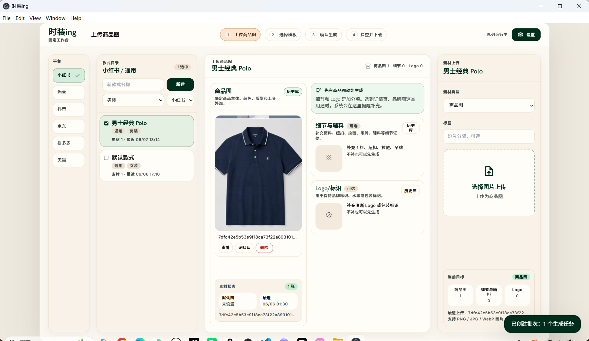
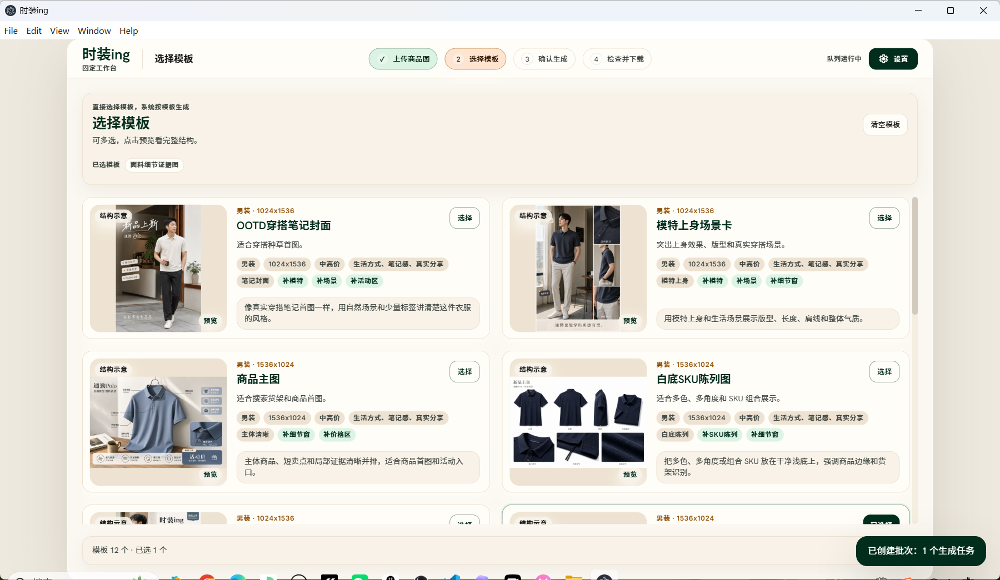
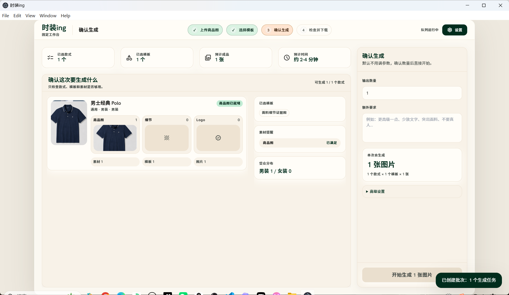
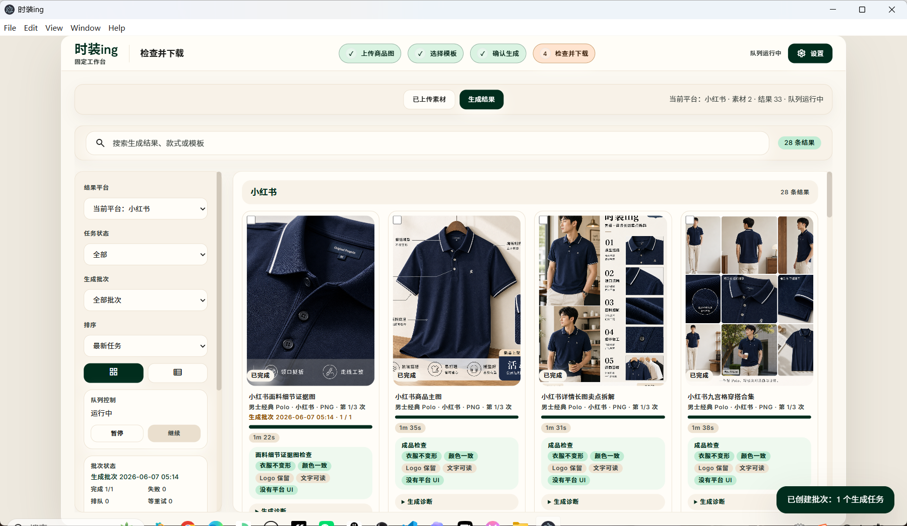
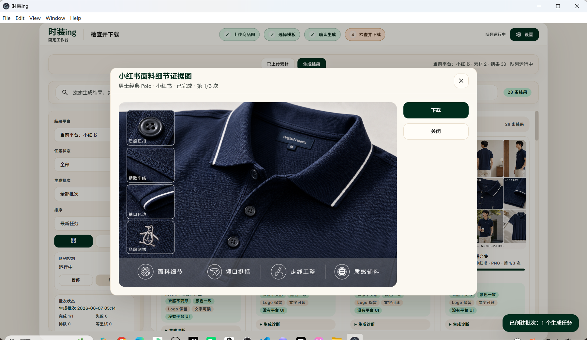

# Trying On｜试装（正在进行时）

Trying On 是一个 Windows 桌面版服装电商出图工具，面向服装商家、电商运营、图片制作人员和需要快速做商品图的店主。

它把服装出图流程压成四步：上传商品图，选择模板，确认生成，检查并下载成品。你不需要自己搭建服务器，也不需要改代码，只要在软件里填写可用的 `Base URL`、`API Key` 和模型名称，就可以调用兼容的图片生成接口完成出图。

## 推荐下载

普通用户请下载 Release 发布包，而不是右上角绿色 `Code -> Download ZIP`：

**下载地址：** <https://github.com/kira987654321/trying-on/releases/tag/v0.1.0>

下载后这样运行：

1. 下载 `trying-on-0.1.0-win-x64.zip`
2. 解压 zip
3. 进入 `时装ing-win-x64`
4. 双击 `时装ing.exe`
5. 打开软件右上角 `设置`
6. 填写 `Base URL`、`API Key` 和模型名称
7. 上传商品图，选择模板，开始生成

Release 包解压后可以直接双击 `时装ing.exe` 运行，不需要恢复脚本。

## 实机演示

### 1. 上传商品图

第一步只需要把服装商品图放进来。商品图是生成的核心素材，其他细节图、Logo 或辅料可以按需要补充。

### 2. 选择模板

第二步选择适合当前平台和用途的模板。模板负责控制图片的大方向，例如商品主图、内容封面、活动图、详情页卖点图等。

### 3. 确认生成

第三步检查本次要生成多少张图、使用哪些模板、素材是否足够。确认无误后点击开始生成。

### 4. 检查结果并下载

第四步查看生成结果，按衣服是否变形、颜色是否一致、Logo 是否保留、文字是否可读等检查项快速审核，然后下载或批量导出。

### 5. 预览成品

生成后的图片可以单张预览，也可以保存到本地，方便继续用于店铺上架、活动页面或内容发布。

## 主要能力

- 服装商品图上传和素材复用
- 多平台电商模板方向
- 男装、女装模板体系
- 多模板批量生成
- 本地生成历史
- 结果质检提示
- 单张下载和批量导出
- Windows 桌面端运行

## API 和 Base URL 配置

Trying On 使用 OpenAI-compatible image generation API。项目不在 GitHub 上写死任何固定服务商地址，也不会保存或公开你的密钥。

首次使用时，在软件右上角打开 `设置`，填写下面三项：

- `Base URL`：你的图片生成接口地址
- `API Key`：你的接口密钥
- 模型名称：你的服务商提供的图片生成模型名称

填写后保存配置，再回到主流程上传商品图并生成。只要你的服务商接口兼容 OpenAI 风格的图片生成调用，软件就可以按配置发起请求。

请不要把自己的 `API Key` 上传到 GitHub，也不要写进公开文档。

## 为什么不把程序文件夹直接放进仓库？

GitHub 右上角绿色 `Code -> Download ZIP` 下载的是仓库源码压缩包，不是正式的软件安装包。普通仓库不适合存放大型桌面程序文件，尤其本项目的 `时装ing.exe` 单文件约 210MB，超过 GitHub 普通仓库的单文件限制。

所以本仓库首页只保留产品说明和演示截图，真正可运行的软件放在 Release：

- 仓库首页：产品简介、实机截图、使用说明
- Release：正式 Windows x64 下载包
- 用户使用：下载 Release zip，解压后双击 `时装ing.exe`

这样下载入口更清楚，也避免用户拿到源码包后看到分包文件或恢复脚本。

## 当前版本

- 版本：`v0.1.0`
- 系统：Windows x64
- 下载：<https://github.com/kira987654321/trying-on/releases/tag/v0.1.0>

